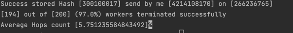
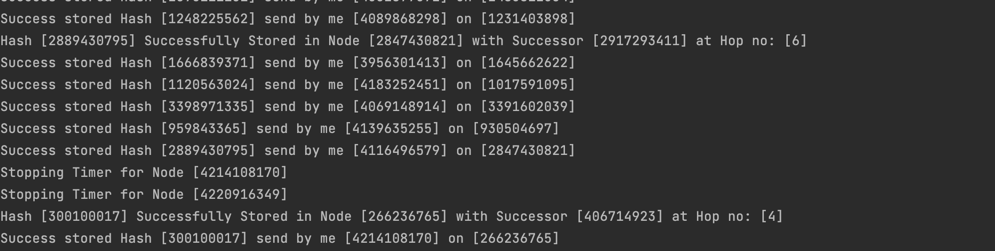
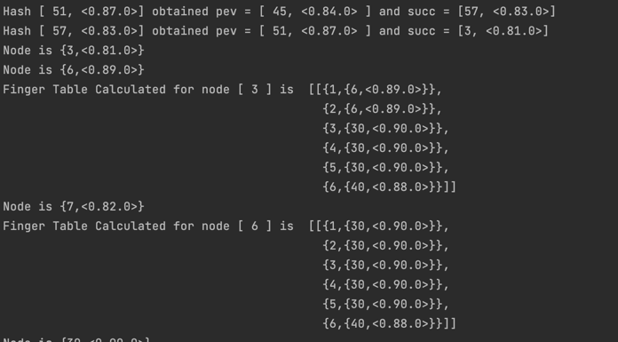
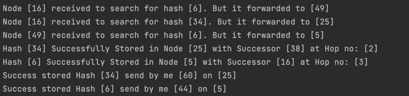

## Erlang Distributed Hash Table (Chord Protocol) Simulation.

This is the actor model based bitcoin mining system in erlang submitted in response
to [project 3](https://ufl.instructure.com/courses/467300/assignments/5383670)
of [COP5615](https://ufl.instructure.com/courses/467300).

#### Team

| Name                     | Gator Email             | UF Id     | Github username |
|--------------------------|-------------------------|-----------|-----------------|
| Ravichandran, Ganeson    | g.ravichandran@ufl.edu  | 10798982 | GANES1998       |
| Munaga, Sai Pavan Kalyan | saipavank.munaga@ufl.edu | 88769245 | saipavankalyan  |

#### Steps of Execution

1. Fill the [variables.env](variables.env) with appropriate values.

| Variable Name         | Use                                                                                       |
|-----------------------|-------------------------------------------------------------------------------------------|
| ERLANG_BIN            | Absolute path to erlang bin.                                                              |

2. Execute ```./project3.sh NumNodes NumRequests``` where
    * NumNodes - Number of Peers participating in the Chord or DHT.
    * NumRequests - Number of requests that each node will fire (one request per second).

#### Assumptions

1. We are using 32 bit hash. Since sha1 generates 160 bit hash, we mimic 32 bit hash using random number between 0, $2^{32} - 1$ (inclusive).
2. Same, For generating any request, we assume a string is taken and is hashed. We generate hash using the same strategy as above (random 32 bit number).
3. We assume, it is okay for requests to get lost, and when request hops for more than 32 times (unlikely in normal times), we discard the request.
4. Since, each node doesn't know all of the peers, We mimic it through supervisor, which redirects a nodes request to another random node.
5. Since we cannot kill a node after it has send required no of requests (as it will be required for processing other requests), we kill a node by inactivity of 20 seconds.
6. The supervisor will keep updating the statistics for each message until no message is obtained for continuous 20 seconds. (For faster termination).

#### Screenshots

Result (Avg Hops Count)


Successfully Stored Record with Hash. (Request Success).


Finger Table Calculation - For easy printing to console, we are using 6 bit hash and 10 nodes and 3 requests/node.


Message getting hopped to next nodes based on finger table.


#### Answers

*2. What is working*

Distributed Hash Table with **NumNodes** peers is constructed and each node is firing **NumRequests** requests at 1 
request/second rate. Since, getting value from hash table and inserting into the table takes same work, we are considering
only insertion. Each node selects a random peer and sends a request to store at a hash. The nodes upon receiving such request
uses finger table to hop the request message to appropriate node and finally to the node, where the hash needs to be inserted.

The hop counts of all such request from all nodes are captured through message passing to the supervisor and final statistics,
(Average hop count) is calculated.

*3. What is the largest network you managed to deal with*

| NumNodes | NumRequest | Average Hop Count |
|----------|------------|-------------------|
| 20_000   | 4          | 6.777             |
| 10_000   | 10         | 7.301             |
| 5_000    | 15         | 7.850             |
| 1_000    | 20         | 6.734             |


